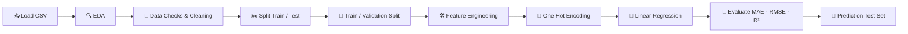

<div align="center">

# 🏠 House Price Prediction 💰

### *Predicting residential property prices with Machine Learning* 🤖📊


**From raw data ➡️ insights ➡️ predictions — a complete end-to-end regression project!** 🚀

</div>

---

## 📑 Table of Contents

- [🌟 Project Overview](#-project-overview)
- [🎯 Objectives](#-objectives)
- [📂 Repository Structure](#-repository-structure)
- [🗃️ Dataset Description](#️-dataset-description)
- [🧰 Tech Stack](#-tech-stack)
- [🔄 Project Workflow](#-project-workflow)
- [🔍 Exploratory Data Analysis](#-exploratory-data-analysis-eda)
- [🧹 Data Cleaning & Preprocessing](#-data-cleaning--preprocessing)
- [🛠️ Feature Engineering](#️-feature-engineering)
- [🤖 Model Building](#-model-building)
- [📈 Results & Evaluation](#-results--evaluation)
- [💡 Key Insights](#-key-insights)
- [⚙️ Installation & Setup](#️-installation--setup)
- [▶️ How to Run](#️-how-to-run)
- [🔮 Future Improvements](#-future-improvements)
- [🤝 Contributing](#-contributing)
- [👨‍💻 Author](#-author)

---

## 🌟 Project Overview

Buying or selling a home is one of the biggest financial decisions in a person's life 🏡💸. But how much is a house *really* worth? 🤔

This project builds a **machine learning pipeline** that estimates the **sale price of a house** from its characteristics — such as lot size, zoning, building type, year built, remodeling year, basement area, exterior material, and more.

The notebook walks through the **entire data science lifecycle**:

> 📥 Load Data → 🔍 Explore → 🧹 Clean → 🛠️ Engineer Features → 🔢 Encode → 🤖 Train → 📏 Evaluate → 🔮 Predict

---

## 🎯 Objectives

- ✅ Understand the structure and quality of the housing dataset
- ✅ Perform thorough **Exploratory Data Analysis (EDA)** with rich visualizations 📊
- ✅ Detect **outliers, missing values, zeros, and data inconsistencies** 🕵️
- ✅ Engineer meaningful new features (e.g., `HasBasement`) 🛠️
- ✅ Build a clean preprocessing pipeline with **One-Hot Encoding** 🔢
- ✅ Train a **Linear Regression** model and evaluate it with **MAE, RMSE and R²** 📏
- ✅ Generate predictions for unseen houses (test set) 🔮

---

## 📂 Repository Structure

```
🏠 House-Price-Prediction/
│
├── 📓 HousePricePrediction.ipynb   # Main Jupyter Notebook (EDA + Modeling)
├── 📄 HousePricePrediction.csv     # Dataset (train + test rows combined)
└── 📘 README.md                    # Project documentation (you are here!)
```

---

## 🗃️ Dataset Description

The dataset contains **2,919 rows** and **13 columns**.

| 📌 Split | 🔢 Rows | 📝 Description |
|---------|--------|---------------|
| 🏋️ **Training data** | 1,460 | Rows where `SalePrice` is known |
| 🧪 **Test data** | 1,459 | Rows where `SalePrice` is missing (to be predicted) |
| 📦 **Total** | 2,919 | Combined file |

### 🧾 Feature Dictionary

| # | 🏷️ Feature | 🔤 Type | 📖 Description |
|---|-----------|--------|---------------|
| 1 | `Id` | Numeric | Unique identifier of each house *(dropped before modeling)* |
| 2 | `MSSubClass` | Categorical | Type of dwelling involved in the sale (stored as a code) |
| 3 | `MSZoning` | Categorical | General zoning classification (RL, RM, FV, RH, C) |
| 4 | `LotArea` | Numeric | Lot size in square feet 📐 |
| 5 | `LotConfig` | Categorical | Lot configuration (Inside, Corner, CulDSac, FR2, FR3) |
| 6 | `BldgType` | Categorical | Type of dwelling (1Fam, TwnhsE, Duplex, Twnhs, 2fmCon) |
| 7 | `OverallCond` | Numeric | Overall condition rating (1 = poor, 9 = excellent) ⭐ |
| 8 | `YearBuilt` | Numeric | Original construction year 🏗️ |
| 9 | `YearRemodAdd` | Numeric | Remodel year (same as construction year if no remodel) 🔨 |
| 10 | `Exterior1st` | Categorical | Exterior covering on the house (VinylSd, MetalSd, etc.) |
| 11 | `BsmtFinSF2` | Numeric | Type-2 finished basement area (sq ft) |
| 12 | `TotalBsmtSF` | Numeric | Total basement area (sq ft) 🏚️ |
| 13 | `SalePrice` | Numeric | 🎯 **Target variable** — the sale price in USD 💵 |

### 📊 Quick Stats on the Target (`SalePrice`)

| 📏 Metric | 💲 Value |
|----------|---------|
| Mean | ≈ $180,921 |
| Minimum | $34,900 |
| Maximum | $755,000 |
| Skewness | ≈ 1.88 (right-skewed 📈) |

---

## 🧰 Tech Stack

| 🔧 Tool | 🎯 Purpose |
|--------|-----------|
| 🐍 **Python** | Core programming language |
| 🐼 **Pandas** | Data loading, manipulation, and analysis |
| 🔢 **NumPy** | Numerical computations |
| 📊 **Matplotlib** | Plotting and visualization |
| 🎨 **Seaborn** | Statistical visualizations (histograms, boxplots, heatmaps) |
| 🤖 **Scikit-learn** | Train/validation split, preprocessing, modeling, metrics |
| 📓 **Jupyter Notebook** | Interactive development environment |

---

## 🔄 Project Workflow



---

## 🔍 Exploratory Data Analysis (EDA)

A big part of this project is **understanding the data before modeling**. 🧐

### 📌 1. Dataset Inspection
- 👀 `df.head()`, `df.shape`, `df.describe()`, `df.dtypes`
- 🕳️ `df.isnull().sum()` to locate missing values
- 👯 `df.duplicated().sum()` ➡️ **0 duplicate rows** ✅

### 📌 2. Distribution Analysis 📈
Histograms with **KDE curves** were plotted for:
`SalePrice`, `LotArea`, `OverallCond`, `YearBuilt`, `YearRemodAdd`, `BsmtFinSF2`, and `TotalBsmtSF`.

### 📌 3. Categorical Analysis 📦
Value counts and **boxplots against `SalePrice`** for:

| 🏷️ Feature | 🔝 Most Common Category |
|-----------|------------------------|
| `MSZoning` | **RL** (2,265 houses) |
| `LotConfig` | **Inside** (2,133 houses) |
| `BldgType` | **1Fam** (2,425 houses) |
| `Exterior1st` | **VinylSd** (1,025 houses) |

### 📌 4. Correlation Analysis 🔥
A **heatmap** of the numeric features revealed how each variable relates to `SalePrice`:

| 🔢 Feature | 🔗 Correlation with SalePrice |
|-----------|------------------------------|
| 🏚️ `TotalBsmtSF` | **+0.61** 💪 *(strongest)* |
| 🏗️ `YearBuilt` | **+0.52** |
| 🔨 `YearRemodAdd` | **+0.51** |
| 📐 `LotArea` | +0.26 |
| ⭐ `OverallCond` | −0.08 |
| 🧱 `BsmtFinSF2` | −0.01 |

### 📌 5. Scatter Plots 🎯
Scatter plots of `SalePrice` against `TotalBsmtSF`, `YearBuilt`, `YearRemodAdd`, and `LotArea` helped visualize trends and spot outliers.

### 📌 6. Outlier & Anomaly Hunting 🕵️‍♂️
- 🏞️ **Largest lot:** `Id 313` with a lot of **215,245 sq ft**
- 💎 **Most expensive house:** `Id 691` sold for **$755,000**
- 🏚️ **Largest basement:** `Id 1298` with **6,110 sq ft** — yet sold for only **$160,000** (a clear outlier ⚠️)
- ⚠️ **Data inconsistency:** one house (`Id 1876`) has `YearBuilt` (2002) later than `YearRemodAdd` (2001)
- 0️⃣ **Zero values:** `BsmtFinSF2` has **2,571** zeros and `TotalBsmtSF` has **78** zeros (meaning *no basement*)

---

## 🧹 Data Cleaning & Preprocessing

### 🕳️ Missing Values Found

| 📋 Column | ❓ Missing | 🩹 Strategy Used |
|----------|-----------|-----------------|
| `MSZoning` | 4 | Filled with the **mode** (most frequent value) |
| `Exterior1st` | 1 | Filled with the **mode** |
| `BsmtFinSF2` | 1 | Filled with **0** |
| `TotalBsmtSF` | 1 | Filled with **0** |
| `SalePrice` | 1,459 | *Expected* — these are the **test rows** to predict 🎯 |

### ✂️ Data Splitting

```python
train = df[df['SalePrice'].notna()].copy()   # 🏋️ 1,460 rows with known prices
test  = df[df['SalePrice'].isna()].copy()    # 🧪 1,459 rows to predict
```

The training data was then split further to **validate the model honestly**:

| 🗂️ Set | 🔢 Rows |
|-------|--------|
| 🏋️ Training | 1,168 (80%) |
| ✅ Validation | 292 (20%) |
| 🧪 Test (unseen) | 1,459 |

```python
X_train, X_val, y_train, y_val = train_test_split(X, y, test_size=0.2, random_state=42)
```

### 🧽 Other Preprocessing Steps
- 🗑️ Dropped the `Id` column (it carries no predictive information)
- 🔤 Converted `MSSubClass` to **string/categorical** (it is a *code*, not a quantity!)

---

## 🛠️ Feature Engineering

A new binary feature was created to capture whether a house has a basement:

```python
X_train['HasBasement'] = (X_train['TotalBsmtSF'] > 0).astype(int)
```

| 🏷️ New Feature | 📖 Meaning |
|---------------|-----------|
| `HasBasement` | `1` = house has a basement 🏚️, `0` = no basement ❌ |

### 🔢 Encoding Categorical Variables

A **`ColumnTransformer`** with **`OneHotEncoder`** converts categories into numbers the model can understand:

| 🔤 Categorical Features (One-Hot Encoded) | 🔢 Numerical Features (Passed Through) |
|------------------------------------------|----------------------------------------|
| `MSSubClass` | `LotArea` |
| `MSZoning` | `OverallCond` |
| `LotConfig` | `YearBuilt` |
| `BldgType` | `YearRemodAdd` |
| `Exterior1st` | `BsmtFinSF2` |
| | `TotalBsmtSF` |
| | `HasBasement` |

```python
preprocessor = ColumnTransformer(
    transformers=[("cat", OneHotEncoder(handle_unknown="ignore"), categorical_cols)],
    remainder="passthrough"
)
```

📐 After encoding, the feature matrix has **52 columns**.
🛡️ `handle_unknown="ignore"` ensures the pipeline won't crash if the test set contains unseen categories.
🔒 The encoder is **fit only on training data** and only *transformed* on validation/test data — preventing **data leakage**! 🚫💧

---

## 🤖 Model Building

### 📉 Algorithm: Linear Regression

```python
from sklearn.linear_model import LinearRegression

model = LinearRegression()
model.fit(X_train_encoded, y_train)
y_pred = model.predict(X_val_encoded)
```

**Why Linear Regression?** 🤔
- ⚡ Fast to train and easy to interpret
- 🧱 A solid **baseline** before moving to more complex models
- 📏 Gives a clear benchmark to beat

---

## 📈 Results & Evaluation

The model was evaluated on the **held-out validation set (292 houses)**:

| 📏 Metric | 🔢 Score | 📖 What it means |
|----------|---------|-----------------|
| **MAE** (Mean Absolute Error) | **≈ $31,045** | On average, predictions are off by about $31K |
| **RMSE** (Root Mean Squared Error) | **≈ $48,699** | Penalizes big errors more heavily |
| **R² Score** | **≈ 0.691** | The model explains about **69%** of the variance in house prices 🎉 |

```python
mae  = mean_absolute_error(y_val, y_pred)
rmse = np.sqrt(mean_squared_error(y_val, y_pred))
r2   = r2_score(y_val, y_pred)
```

### 🏆 Verdict
For a **baseline model** using only **12 raw features**, an R² of ~0.69 is a solid starting point! 💪 There's plenty of room to improve with richer features and more advanced algorithms (see [Future Improvements](#-future-improvements)).

### 🔮 Predictions on the Test Set
The trained model generates predictions for all **1,459 unseen houses**:

```python
test_predictions = model.predict(X_test_encoded)
```

---

## 💡 Key Insights

1. 🏚️ **Basement size matters most** among the numeric features — `TotalBsmtSF` has the strongest correlation with price (+0.61).
2. 🏗️ **Newer homes sell for more** — both `YearBuilt` (+0.52) and `YearRemodAdd` (+0.51) show clear positive relationships.
3. 🌆 **Zoning drives price** — Floating Village (`FV`) homes have the highest median price (~$206K), while commercial (`C (all)`) zones have the lowest (~$75K).
4. 🏘️ **Dwelling type matters** — single-family (`1Fam`) and end-unit townhouses (`TwnhsE`) have higher median prices than duplexes and two-family conversions.
5. 🌳 **Cul-de-sac lots** command a premium, with the highest median price among lot configurations (~$199K).
6. ⭐ **Condition alone isn't enough** — `OverallCond` has almost no linear relationship with price here (−0.08).
7. 📈 **Prices are right-skewed** (skewness ≈ 1.88) — a few luxury homes pull the average up. A log-transform may help future models.
8. ⚠️ **Outliers exist** — e.g., a house with a 6,110 sq ft basement sold for just $160K, which can hurt a linear model.

---

## ⚙️ Installation & Setup

### 📋 Prerequisites
- 🐍 Python **3.8 or higher**
- 📦 `pip` package manager

### 📥 Step 1: Clone the Repository
```bash
git clone https://github.com/<your-username>/House-Price-Prediction.git
cd House-Price-Prediction
```

### 🧪 Step 2: Create a Virtual Environment *(optional but recommended)*
```bash
python -m venv venv

# 🪟 Windows
venv\Scripts\activate

# 🍎🐧 macOS / Linux
source venv/bin/activate
```

### 📦 Step 3: Install Dependencies
```bash
pip install pandas numpy matplotlib seaborn scikit-learn jupyter
```

---

## ▶️ How to Run

1. 🚀 Launch Jupyter Notebook:
   ```bash
   jupyter notebook
   ```
2. 📂 Open **`HousePricePrediction.ipynb`**
3. ⚠️ Make sure `HousePricePrediction.csv` is in the **same folder** as the notebook
4. ▶️ Click **Kernel ➡️ Restart & Run All**
5. 🎉 Explore the plots, metrics, and predictions!

---

## 🔮 Future Improvements

There's lots of room to level up this project! 🚀

- [ ] 🔄 Try advanced models: **Random Forest, Gradient Boosting, XGBoost, LightGBM** 🌲⚡
- [ ] 📉 Apply a **log transformation** to `SalePrice` to fix skewness
- [ ] 🧹 Detect and handle **outliers** (e.g., huge lots and basements)
- [ ] 🧬 Create more features: `HouseAge`, `YearsSinceRemodel`, `IsRemodeled`, `LotArea` per unit
- [ ] 🔁 Use **K-Fold Cross-Validation** for more reliable scoring
- [ ] 🎛️ **Hyperparameter tuning** with `GridSearchCV` / `RandomizedSearchCV`
- [ ] 🧱 Wrap everything in a **scikit-learn `Pipeline`** for cleaner, reusable code
- [ ] 🛡️ Try **Ridge / Lasso** regularization
- [ ] 🌐 Build a **Streamlit / Flask web app** for live predictions 🖥️
- [ ] 💾 Save the trained model with **joblib / pickle**
- [ ] 📤 Export predictions to a **CSV** file

---

## 🤝 Contributing

Contributions, issues, and feature requests are welcome! 🙌

1. 🍴 Fork the repository
2. 🌿 Create a new branch (`git checkout -b feature/AmazingFeature`)
3. 💾 Commit your changes (`git commit -m 'Add some AmazingFeature'`)
4. 📤 Push to the branch (`git push origin feature/AmazingFeature`)
5. 🔃 Open a Pull Request

---

## 👨‍💻 Author

<div align="center">

### **Devan S Patel** 🎓
*Student at PPSU* 🏫

💬 *Feel free to reach out for feedback, ideas, or collaboration!*

</div>

---

<div align="center">

### ⭐ If you found this project helpful, please give it a star! ⭐

**Made with ❤️, ☕ and 🐍 Python**

*Happy Predicting! 🏡📈✨*

</div>
